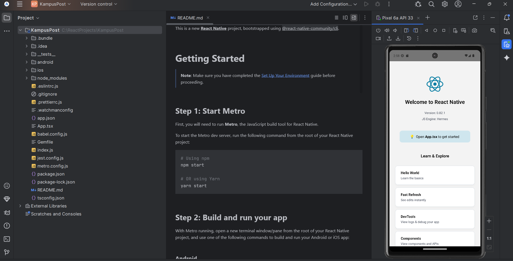
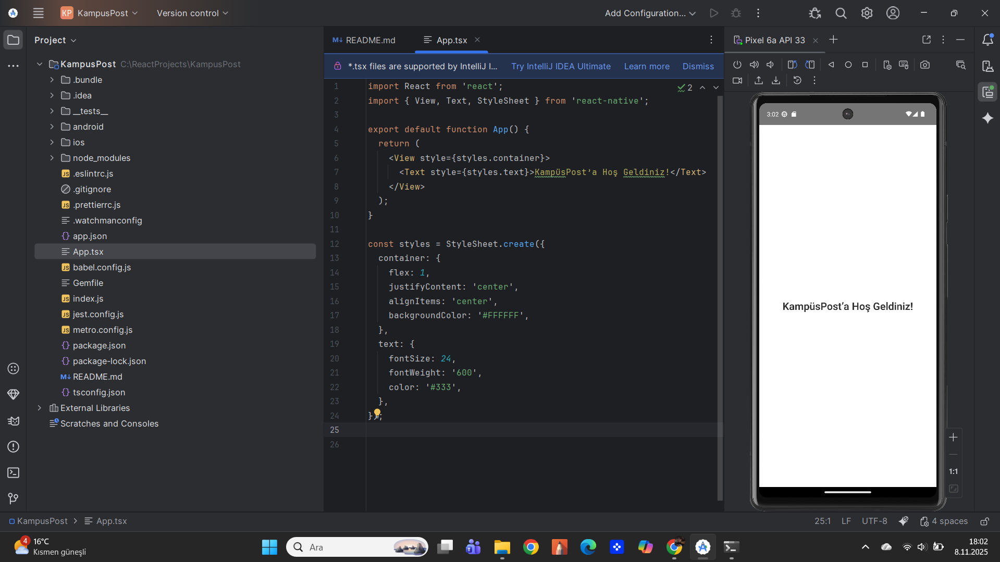
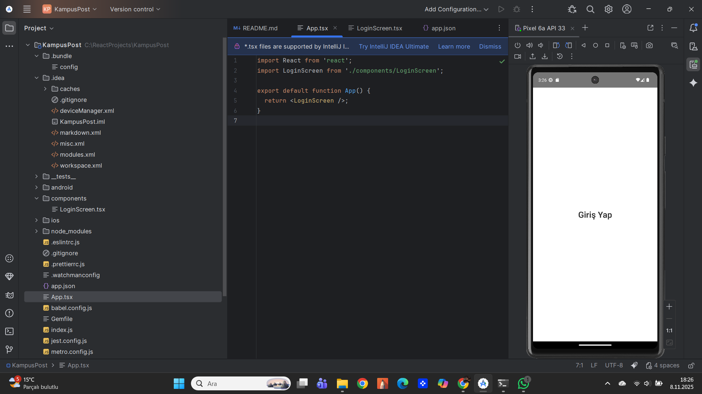
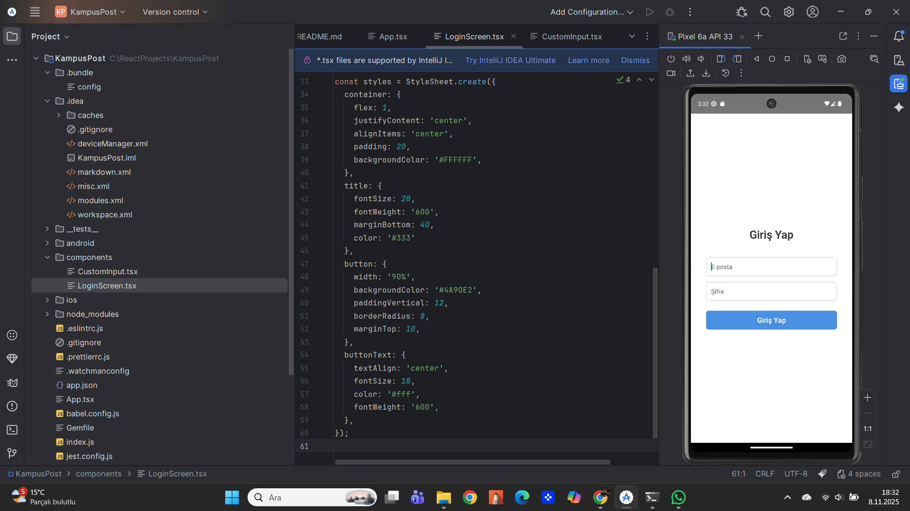
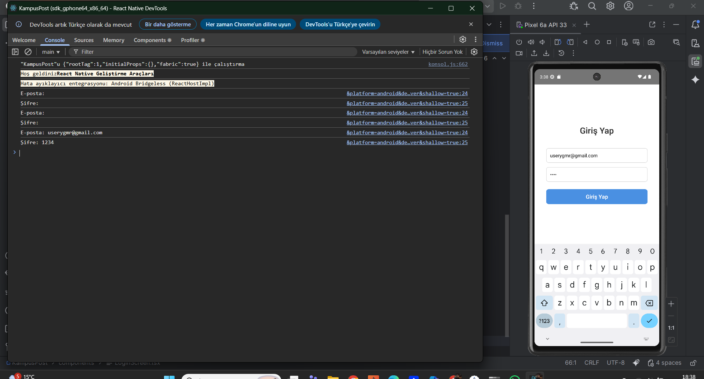
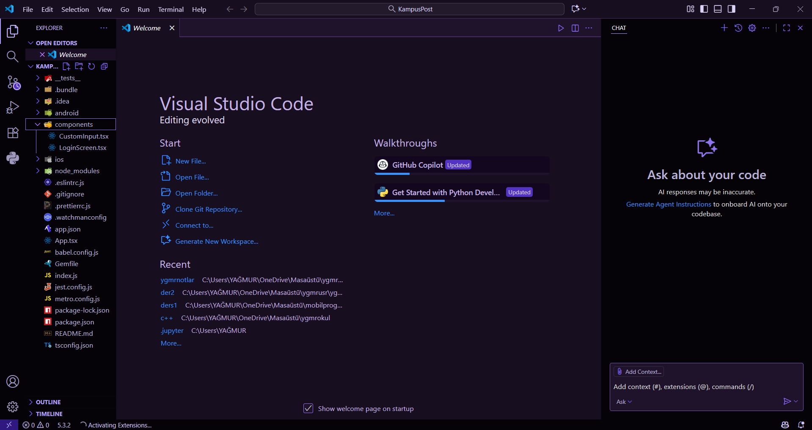
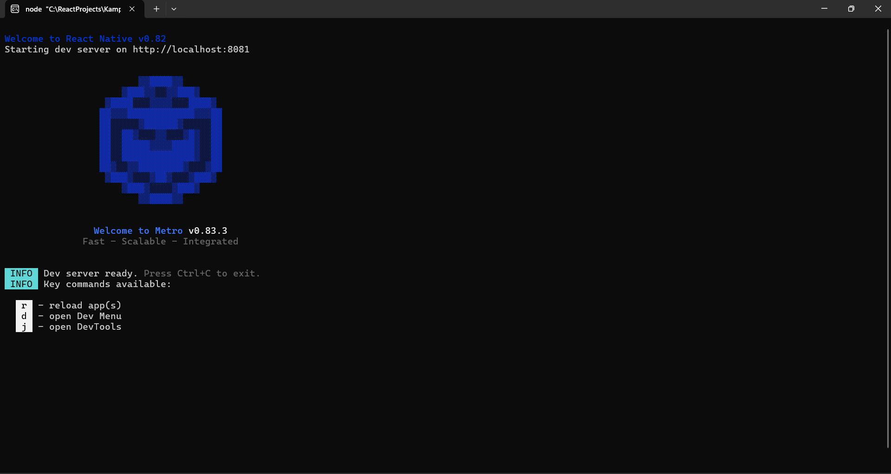

# KampüsPost

React Native ile geliştirilmiş basit bir giriş ekranı uygulaması.

---

## Proje Klasör Görünümü

---

## Hoş Geldiniz Ekranı

---

## Giriş Ekranı

---

## Giriş Formu (E-posta & Şifre Alanları)

---

## Konsola Yazdırma (Giriş Yap Butonu)

---

## Uygulamanın Çalışma Görüntüsü (Emülatör)

---

## GitHub Repository Görünümü

---

### Kullanılan Teknolojiler
- React Native
- TypeScript / JavaScript
- Android Emulator

---

### Geliştirici
**Yağmur Özçift**
